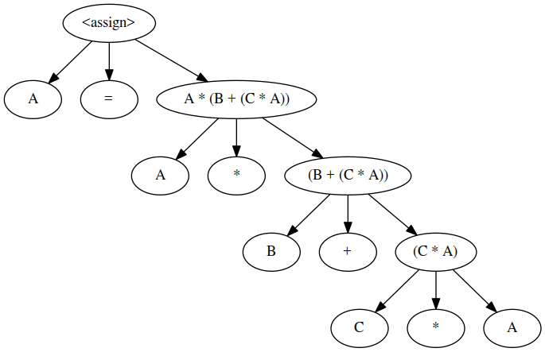
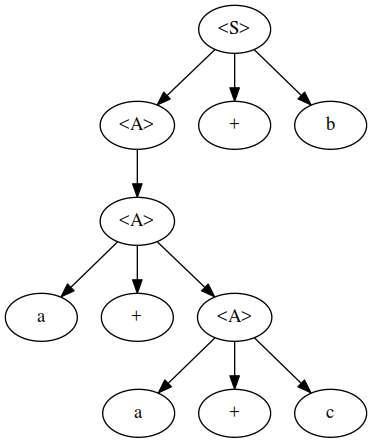
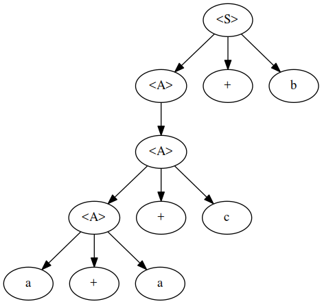
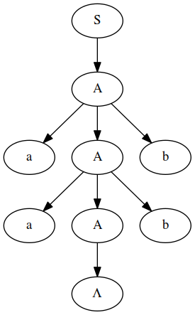
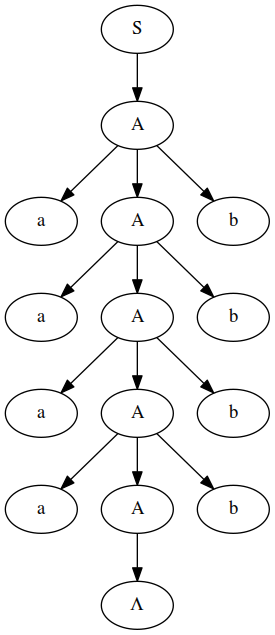

### \#7a

### \#8

Two possible graphs using grammar, ambiguous.

### \#9

$$
\begin{aligned}
<assign> &\to <id> = <expr> \\
    <id> &\to A | B | C \\
  <expr> &\to <expr> + <term> | <term> \\
  <term> &\to <term> * <factor> | <negate> \\
<negate> &\to -<expr> | <factor> \\
<factor> &\to ( <expr> ) | <id> \\
\end{aligned}
$$

### \#13

$$
\begin{aligned}
	S &\to A \\
	A &\to aAb | \Lambda \\
\end{aligned}
$$

### \#14

aabb

aaaabbbb

### \#21b

### \#23a

$$
\begin{aligned}
  \{\textsc{??}\} a = 2 \times (b - 1) - 1 & \{a > 0\} \\
                                           & \{2 \times (b - 1) - 1> 0\} \\
                                           & \{2 \times (b - 1) > 1\} \\
                                           & \{b - 1 > \frac{1}{2}\} \\
                                           & \{b > \frac{1}{2} + 1\} \\
                                           & \{b > \frac{3}{2}\} \\
  \{b > \frac{3}{2}\} a = 2 \times (b -1) - 1 & \{a > 0\} \\
\end{aligned}
$$

### \#24a

$$
\begin{aligned}
	\{\textsc{??}\} a = 2 \times b + 1; b = a -3; & \{b < 0\} \\
	\{\textsc{??}\} a = 2 \times b + 1;           & \{a - 3 < 0\} \\ 
	                                              & \{a < 3\} \\
	                                              & \{2b + 1 < 3\} \\
	                                              & \{2b < 2\} \\
	                                              & \{b < 1\} \\
	      \{b < 1\} a = 2 \times b + 1; b = a -3; & \{b < 0\} \\
\end{aligned}
$$

### \#28

$$
\begin{aligned}
 	            P & \implies I \\
	        \{I\} &= (sum = (count) + (count - 1) + ... + 1) \&\& \{count >= 0\} \\
\\
	 \{I \&\& B\} &= (sum = (count) + (count - 1) + ... + 1) \&\& \{count >= 0\} \&\& \{count \neq 0\} \\
\\
	              &= (sum = (count) + (count - 1) + ... + 1) \&\& \{count > 0\} \\
\\
            \{P\} &= (count = count - 1) \{I\} \\
		          &= count - 1 >= 0 \\
                  &= count >= 1 \\
\\
\{I \&\& \neg B\} & \implies Q \\
\{I \&\& \neg B\} &= (sum = count + (count - 1) + ... + 1) \&\& \{count >= 0\} \&\& \{count = 0\} \\
		        Q &= \{sum = count + (count-1) + ... + 1\} \\
\end{aligned}
$$

### 12) using invarient in 28, prove partial correctness

See above

### 13)

Let the Alphabet set = {a,b}. Find a Context - Free Grammar and a Regular Expression for the following language:
$$
\begin{aligned}
  \Sigma &= \{a,b\} \\
  \\
  L   &= \{\textsc{All strings that have different first and last letters}\} \\
  RE  &= a(a+b)^{*}b \\
  BNF & \\
    S &\to A \\
    A &\to aBb | B \\
	B &\to aB | bB | \Lambda \\
  \\
  L   &= \{ab,ba,aab,abb,baa,bba,.....\} \\
  RE  &= (a+b)^{+} \\
  BNF & \\
    S &\to A \\
    A &\to aA | bA | \Lambda \\
\end{aligned}
$$
